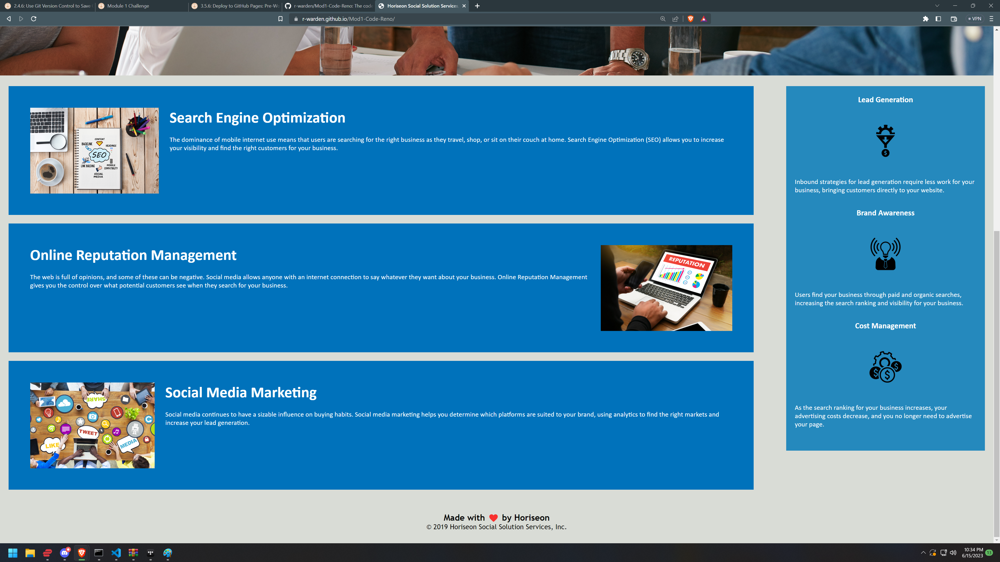

# Code Refactor Challenge for Module 1

## Description

This is a refactor of the code for a landing page for hypothetical marketing firm Horiseon. It was reworked to debug, optimize semantics for readability and SEO, and consolidation of redundant code.

## Table of Contents

- [Installation](#installation)
- [Usage](#usage)
- [Screenshots](#screenshots)
- [Credits](#credits)
- [License](#license)

## Installation

N/A

## Usage

To use this landing page, you can navigate to various sections by using the navigation links in the top right, or simply peruse it at your leisure. The deployed site can be viewed at https://r-warden.github.io/Mod1-Code-Reno/

## Screenshots

## Credits

N/A

## License

Please refer to the license in the repository.